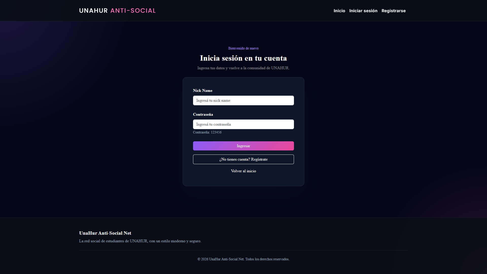
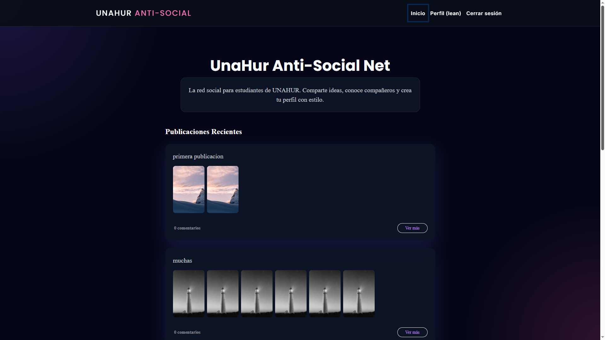
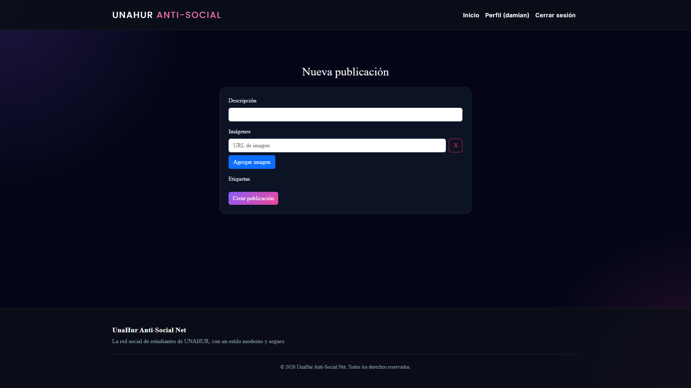
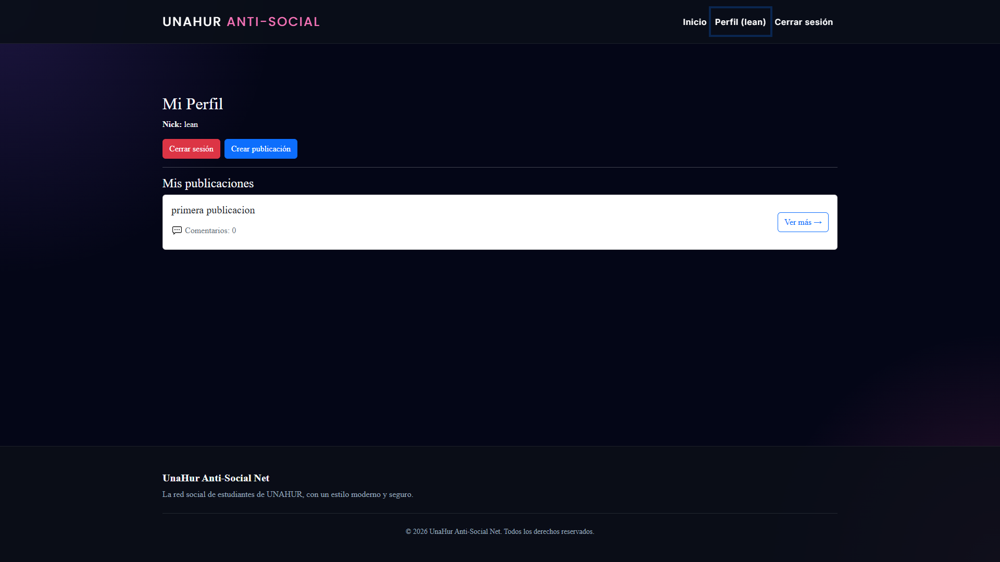
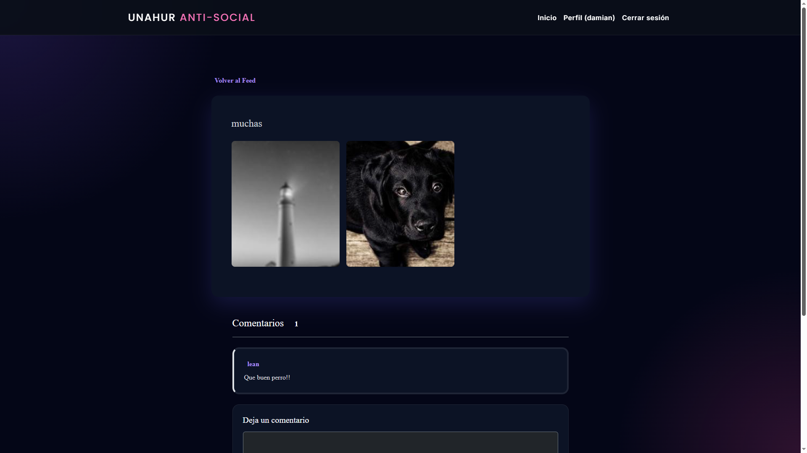
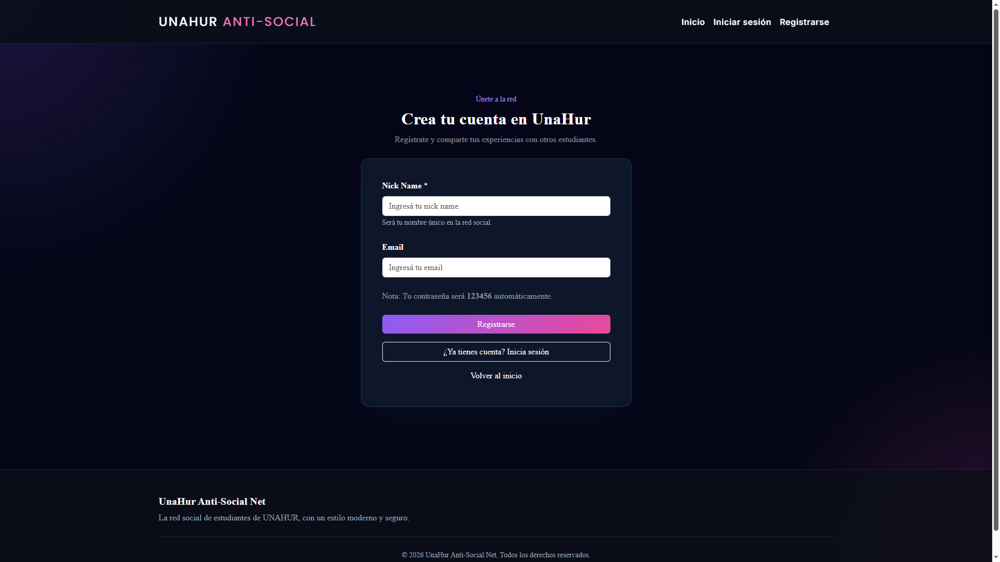

# CIU TP2

## Integrantes

- Franco Ariel Martín
- Guillermo Castro
- Damian Piana

Proyecto React + Vite para la materia CIU.

## Requisitos

- Node.js
- npm

## Instalación

```bash
npm install
```

## Ejecutar en desarrollo

```bash
npm run dev
```

Luego abrir en el navegador la URL que indique Vite, por ejemplo:

```bash
http://localhost:5173/
```

## API Utilizada

Este proyecto utiliza la API provista por la consigna (Caja Negra).

## Capturas

Algunas vistas del proyecto:













## Notas

- La aplicación usa React, React Router y React Bootstrap.
